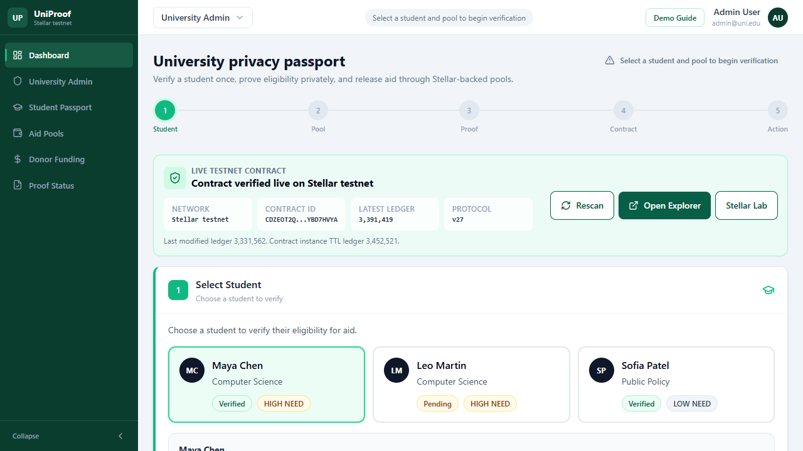
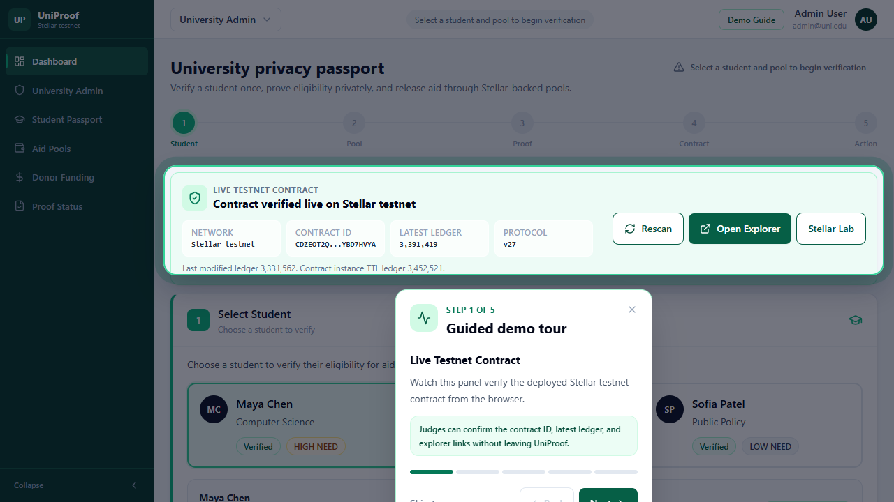
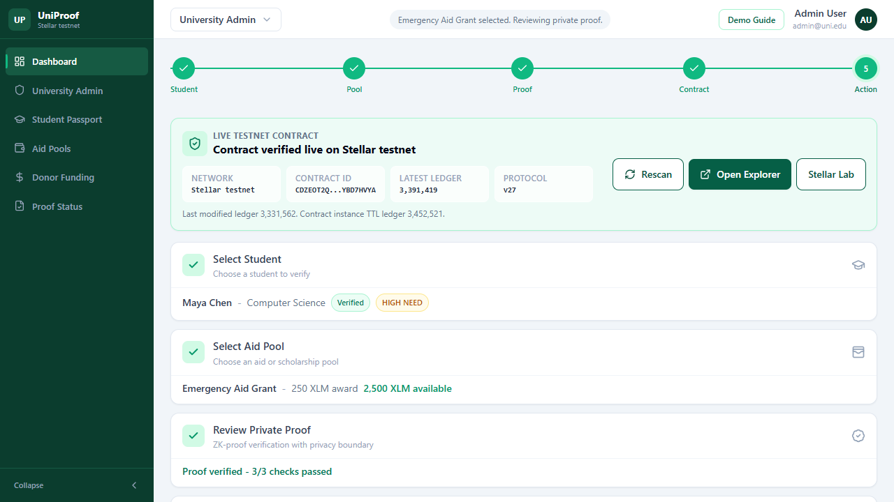
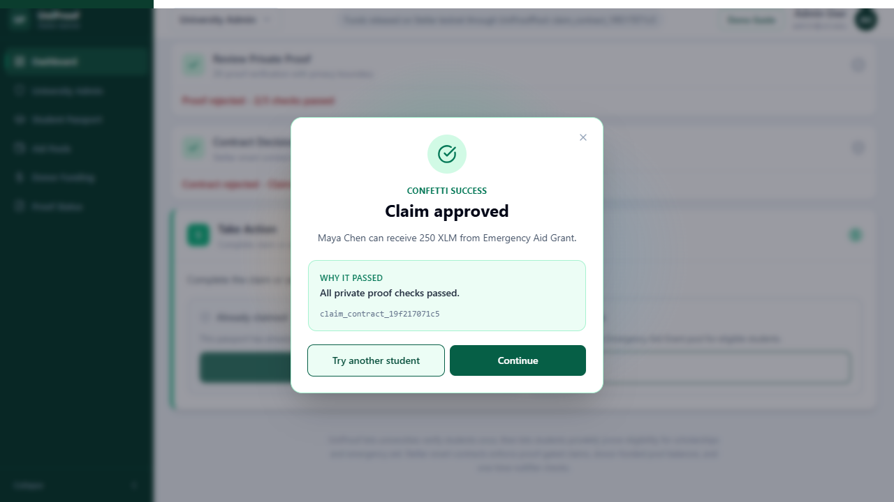
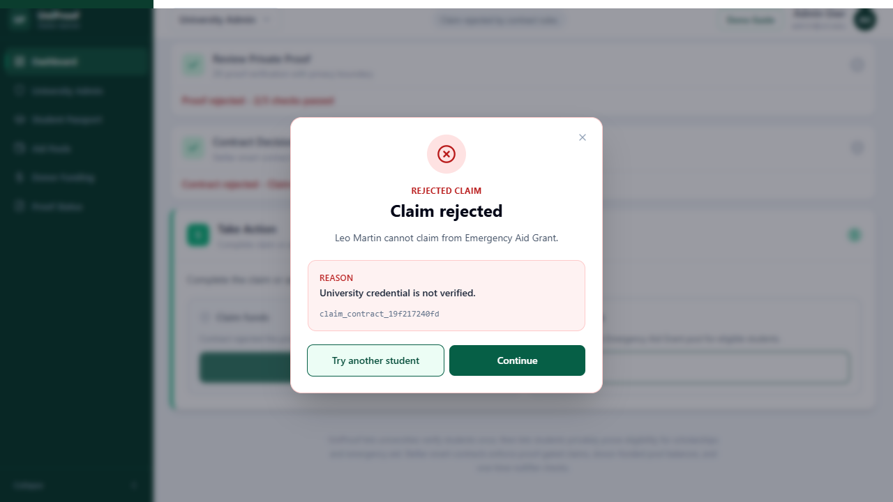
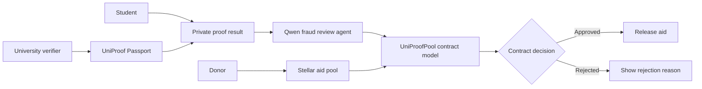

# UniProof

<div align="center">



**A university-first privacy passport for student identity, scholarship eligibility, emergency aid claims, donor-funded support, and AI-assisted fraud review on Stellar.**

[](https://stellar.org)
[](https://soroban.stellar.org)
[](https://react.dev)
[](https://vite.dev)
[](https://www.alibabacloud.com/product/modelstudio)

</div>

## Overview
## Demo link: https://uniproof.vercel.app/
## Demo video: https://youtu.be/6yLdk4qH-vk?si=-2zV-sW-VmCo3Rup


UniProof lets a university verify a student once, then lets that student prove scholarship or emergency-aid eligibility without repeatedly exposing passports, transcripts, income documents, or unrelated wallet history. Before a claim reaches final contract action, a Qwen-powered fraud review agent checks the bounded claim context and explains risk signals to reviewers.

The platform combines:

- University-issued student privacy passports
- Private eligibility checks for scholarships and aid
- Donor-funded Stellar aid pools
- One-time claim enforcement through nullifiers
- A browser-visible Stellar testnet contract scanner for users and reviewers
- A Qwen-backed fraud review agent that scores claim risk before contract release

## Problem

Scholarship and aid systems often ask students to resubmit sensitive documents to every school, donor, or aid program. That creates privacy risk, slow manual review, and duplicate-claim problems.

UniProof gives institutions a reusable verification layer: the student proves the result of an eligibility check, while the app keeps private inputs behind a proof boundary.

## Why Zero-Knowledge

The MVP models the zero-knowledge boundary with a deterministic proof-status layer. A production ZK version would replace this proof model with a real proving system, but the current flow already demonstrates the privacy contract:

- The university credential is valid.
- The selected pool rules match the student proof.
- The claim nullifier has not been used before.
- Funds can release once, and only once.

Users can see the public result - approved, rejected, or already claimed - without needing the student's full identity file.

## Qwen Fraud Review Agent

UniProof includes an AI fraud-review step between private proof review and the Stellar contract decision. The agent is advisory: it helps reviewers understand risk, while the contract model remains the source of truth for fund release.

The agent reviews only bounded claim metadata:

- Credential status
- Pool eligibility rules
- Private proof result
- Nullifier status
- Pool balance and award amount

It returns:

- Risk level: low, medium, or high
- Recommendation: approve, review, or block
- Short explanation for reviewers
- Concrete risk reasons
- Provider status: live Qwen or local fallback

The Qwen API key is handled by a server-side `/api/fraud-agent` route and is never exposed in the browser bundle.

## Users Demo Walkthrough

1. Open UniProof and confirm the **Live Testnet Contract** panel.
2. Use the guided tour to follow the demo path.
3. Select **Maya Chen** for the successful claim flow.
4. Select **Emergency Aid Grant**.
5. Review the private proof.
6. Check the **Qwen Fraud Review Agent** risk signal and recommendation.
7. Review the Stellar contract decision.
8. Click **Release funds** to see the approved claim popup.
9. Click **Try another student**, select **Leo Martin**, and run the same pool to see a rejected claim with the reason.

## Screenshots

### Guided Demo Tour



### Proof Review And Contract Decision



### Claim Outcomes

| Approved claim | Rejected claim |
|---|---|
|  |  |

## Testnet Deployment

UniProof has a deployed Stellar testnet contract for the hackathon demo:

```text
CDZEOT2QWBNWX3O2YWP7WJ43R25S6SKC5PY2P6ENY6WFCDX5YBD7HVYA
```

Network: Stellar testnet

Explorer: [View on Stellar Expert](https://stellar.expert/explorer/testnet/contract/CDZEOT2QWBNWX3O2YWP7WJ43R25S6SKC5PY2P6ENY6WFCDX5YBD7HVYA)

The frontend includes a live browser scanner that connects to Stellar testnet RPC, verifies the contract instance ledger entry, shows the latest ledger/protocol, and links directly to the explorer.

## Architecture



## Tech Stack

**Frontend**

- React
- TypeScript
- Vite
- Tailwind CSS
- Vitest

**Blockchain**

- Soroban smart contract in Rust
- Stellar testnet deployment
- Browser-side Stellar RPC contract scanner
- Frontend contract adapter for demo claim and funding rules

**AI Agent**

- Qwen through Alibaba Cloud Model Studio / DashScope
- Server-side `/api/fraud-agent` proxy so API keys are never exposed in the browser
- Local deterministic fallback for offline demos and missing development keys

## Run Locally

```bash
npm install
npm run dev
```

Then open the local Vite URL shown in your terminal.

The Qwen fraud agent works through a serverless API route in deployment. For Vercel, add this environment variable:

```text
QWEN_API_KEY=your_qwen_or_dashscope_key
```

Optional overrides:

```text
QWEN_MODEL=qwen-plus
QWEN_BASE_URL=https://dashscope-intl.aliyuncs.com/compatible-mode/v1
```

`DASHSCOPE_API_KEY` and `DASHSCOPE_BASE_URL` are also supported. If no key is configured, UniProof labels the review as a local fallback so the demo still runs.

## Test And Build

```bash
npm test
npm run build
```

## Soroban Smart Contract

The contract lives in [`contracts/uniproof_pool/src/lib.rs`](./contracts/uniproof_pool/src/lib.rs).

It models the core blockchain flow:

- Create a university aid or scholarship pool
- Fund the pool
- Accept a proof verification result
- Store a nullifier for each claim
- Reject duplicate claims
- Reduce the pool balance when a verified claim is released

Build the contract WASM with:

```bash
cargo build -p uniproof_pool --target wasm32v1-none --release
```

Expected artifact:

```text
target/wasm32v1-none/release/uniproof_pool.wasm
```

## Project Status

Current hackathon scope:

- Polished React demo for university verification and aid claims
- Multiple student scenarios: approved, unverified, and eligibility mismatch
- Guided judge onboarding tour
- Success and rejection result popups
- Stellar testnet contract ID visible in the browser
- Qwen Fraud Review Agent step with risk level, recommendation, and reasons
- Contract-connected demo logic for balances, nullifiers, and one-time claims

Next steps after the hackathon:

- Replace the deterministic proof model with a full ZK proving system
- Add issuer onboarding for real universities
- Add student wallet/passport management
- Expand donor dashboards and multi-pool reporting
- Prepare mainnet deployment once the proof system and issuer controls are production-ready

## License

UniProof is released under the [MIT License](./LICENSE).
